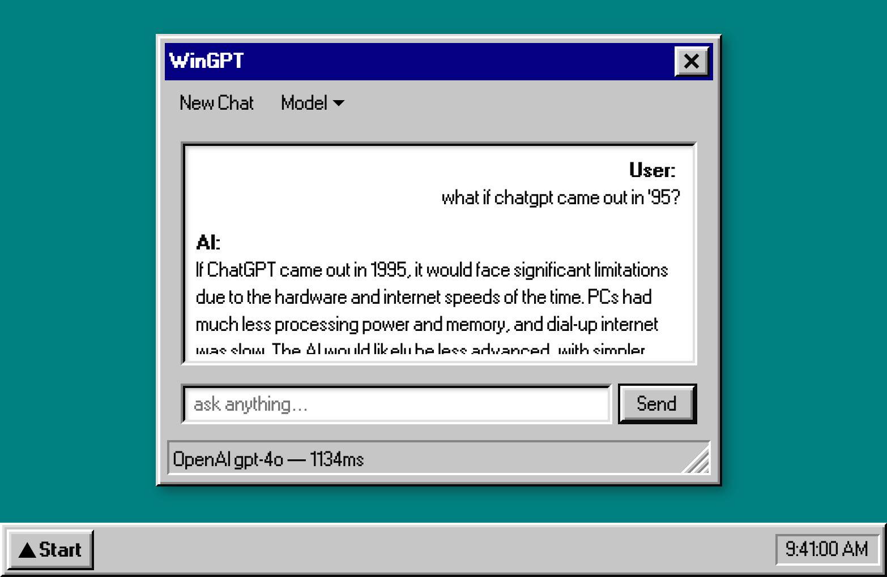

# wingpt

A conversational AI chatbot designed with a Win95 interface, powered by React95.

## Credits

The demo is inspired by [Lucas Crespo's tweet](https://twitter.com/lucas__crespo/status/1795870218234785865) that asks: "What if ChatGPT came out in '95?".

In addition, this demo would not have been possible without the following libraries and frameworks:

- [React95](https://github.com/React95/React95): an UI library of Windows 95 components.
- [Vercel AI SDK](https://sdk.vercel.ai/docs): easy TypeScript API to AI models.
- [Next.js](https://nextjs.org/): React framework (App Router & Turbopack).
- The supporting ecosystem and libraries: [Node.js](https://github.com/nodejs/node), [nanoid](https://github.com/ai/nanoid), [react-draggable](https://github.com/mzabriskie/react-draggable), [react-detect-click-outside](https://github.com/zhaluza/react-detect-click-outside), and [styled-components](https://github.com/styled-components/styled-components) (used by [React95](https://github.com/React95/React95)).

## License

MIT
